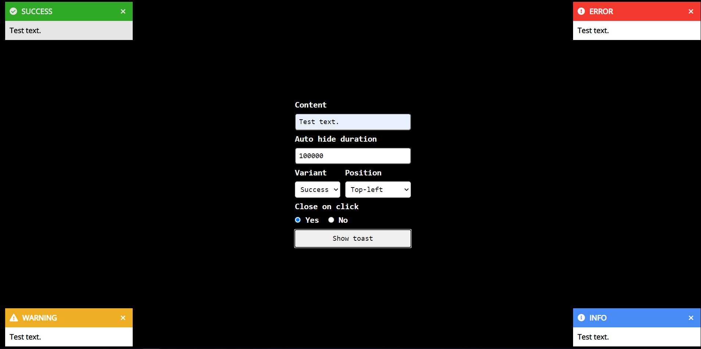

## Brief Description

Toast framework agnostic. Component, that you can customize for your needs.

## Usage

Import toast.css and toast.js files to your project. And use 'show' function to add new toast.
Example:

```
Toast.show('Test text', 'uniqueId', {variant:'error'})
```

'show' function arguments:

```
content: string,
id:string,
options: {
    variant:'success' | 'warning' | 'error' | 'info',
    position:'top-right' | 'top-left' | 'bottom-right' | 'bottom-left',
    autoHideDuration: number,
    closeOnClick: boolean
}
```

Options do not required. Default options:

```
options: {
    variant:'info',
    position:'bottom-right',
    autoHideDuration: 5000,
    closeOnClick: true
}
```

## Playground:

A page has been created where you can test the main functions and features. The 'key' argument is replaced by a random number generation (so as not to fill in this field each time), this is done to simulate the key generated by the server.


